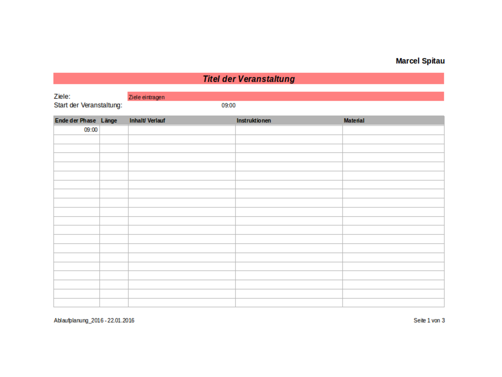

# Ablaufplanung

Diese Vorlage ermöglicht es einen Ablauf eines Seminars, eines Unterrichts oder einer Schulung zu planen und immer die Zeit, das Material und die Instruktionen im Auge zu behalten.

